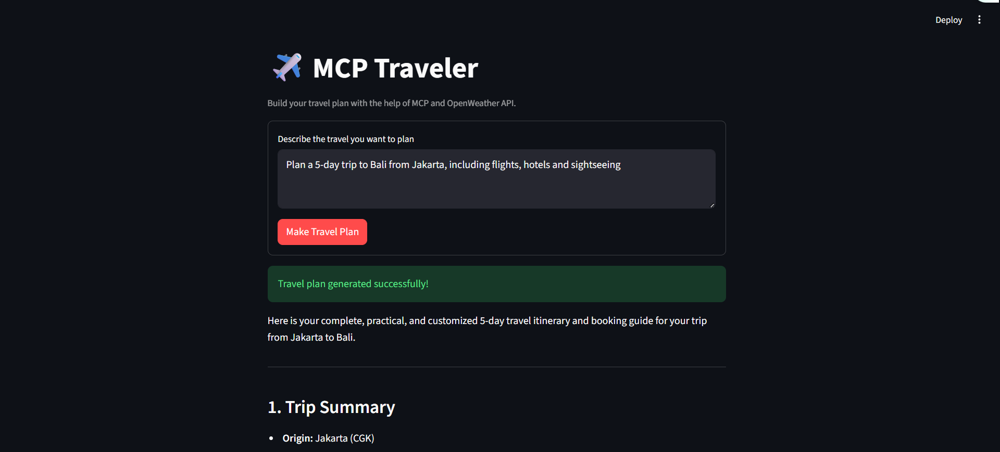
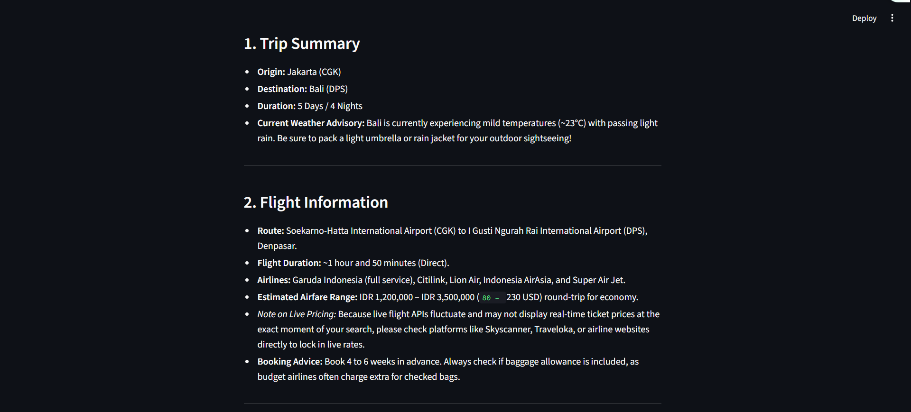
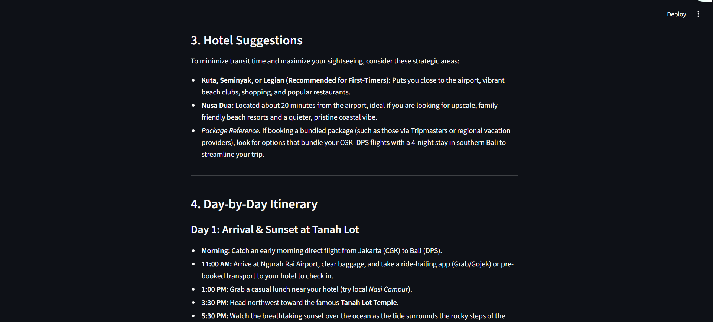
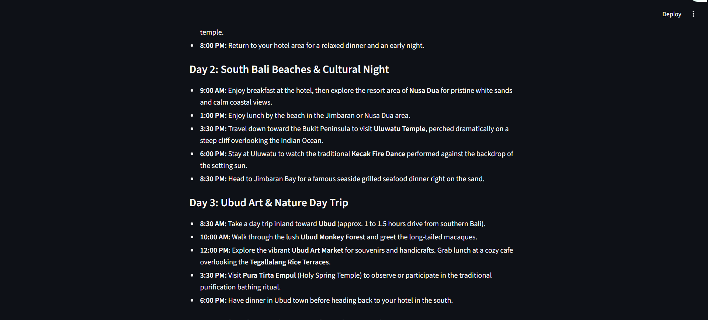
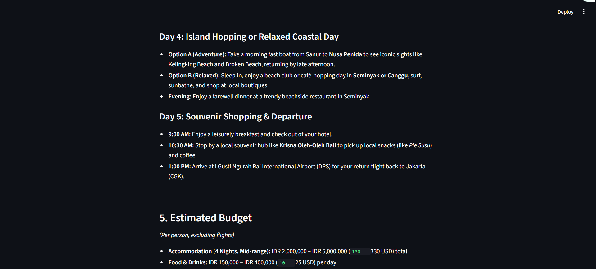
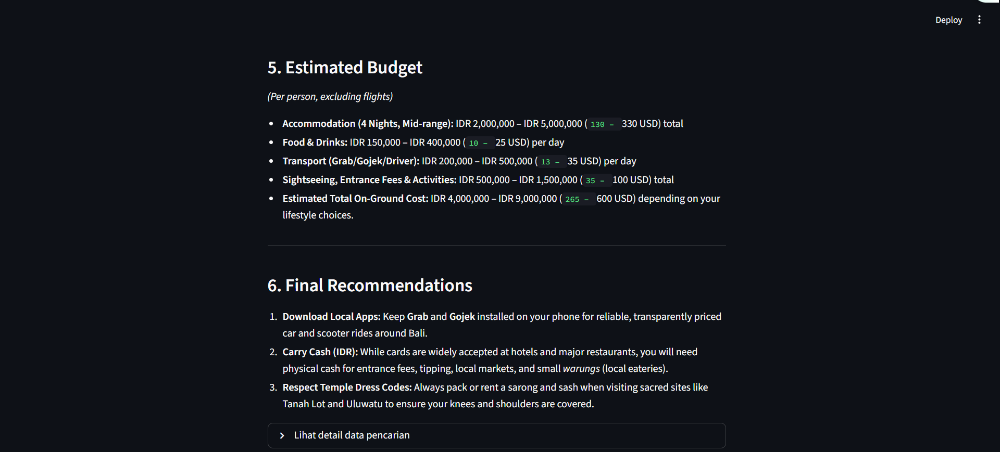
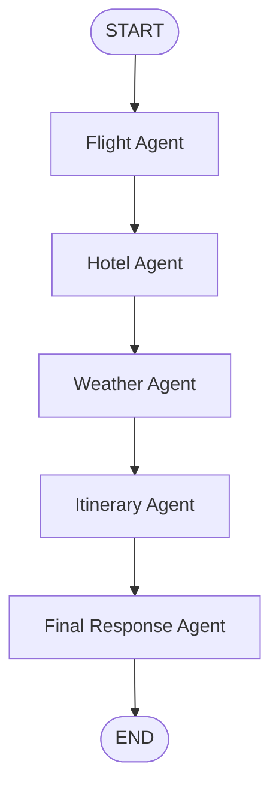

# MCP Traveler

MCP Traveler is an AI-powered travel planning application. Users simply
describe their travel needs in natural language, and the system gathers
flight, hotel, and weather information before creating an itinerary and final
recommendations.

The project uses:

- **LangGraph** to orchestrate the agent workflow sequentially.
- **Google Gemini**, through `ChatGoogleGenerativeAI`, to extract locations,
  analyze search results, and create itineraries.
- **Model Context Protocol (MCP)** to connect agents to Tavily, AviationStack,
  and a local weather server.
- **FastAPI** as the backend API.
- **Streamlit** as the web interface.
- **PostgreSQL** as the LangGraph checkpointer so context associated with a
  `thread_id` can be resumed.

## Streamlit UI Preview

The following screenshots show examples of the Streamlit user interface:

### Travel request



### Flight information



### Hotel suggestions



### Weather information



### Day-by-day itinerary



### Final recommendations



## High-level architecture

```text
Streamlit UI
     |
     v
FastAPI (/travel)
     |
     v
LangGraph Travel Workflow
     |
     +--> AviationStack MCP ----> airport and airline data
     +--> Tavily MCP ------------> hotel search results
     +--> Local Weather MCP -----> current weather and forecast
     |
     v
PostgreSQL Checkpointer
```

## Agent workflow

The workflow runs synchronously and sequentially. Each agent's output is stored
in `TravelState` and becomes the input for the next agent.



### 1. Flight Agent

Implementation: `flight_agent` in `backend.py`.

Process:

1. Reads `user_query`.
2. Calls the AviationStack MCP through `list_airports`.
3. Calls the AviationStack MCP through `list_airlines`.
4. Sends the data to Gemini.
5. Produces departure and arrival airport information, airlines serving the
   route, estimated duration, estimated fare range, peak-season warnings, and
   booking advice.
6. Stores the result in `state["flight_results"]`.

This agent provides flight guidance. Ticket prices are estimates and may not
always be available from a live API.

### 2. Hotel Agent

Implementation: `hotel_agent` in `backend.py`.

Process:

1. Builds the query `Best hotels for <user_query>`.
2. Calls `tavily_search` through the Tavily MCP.
3. Takes up to five search results.
4. Normalizes the MCP results and displays each hotel's title, URL, and
   snippet.
5. Stores the result in `state["hotel_results"]`.

Tavily is used as a web search engine; its results are not a booking inventory
or confirmation of room availability.

### 3. Weather Agent

Implementation: `weather_agent` in `backend.py`.

Process:

1. Asks Gemini to extract the destination city or country from `user_query`.
2. Calls `get_current_weather` on the local Weather MCP.
3. Calls `get_forecast` on the local Weather MCP.
4. Combines the current weather with the first five forecast entries.
5. Stores the result in `state["weather_results"]`.

### 4. Itinerary Agent

Implementation: `itinerary_agent` in `backend.py`.

Process:

1. Reads the user's query.
2. Reads flight, hotel, and weather results from the state.
3. Asks Gemini to create a complete, practical, easy-to-follow itinerary that
   considers the budget.
4. Stores the daily results in `state["itinerary"]`.

### 5. Final Response Agent

Implementation: `final_agent` in `backend.py`.

Process:

1. Combines the user's request with the flight, hotel, weather, and itinerary
   results.
2. Asks Gemini to create an easy-to-read final answer.
3. The answer is instructed to include Trip Summary, Flight Information,
   Hotel Suggestions, Day-by-Day Itinerary, Estimated Budget, and Final
   Recommendations.
4. Returns the final answer as `answer` in the API response.

## MCP servers and tools

All server configurations are located in `mcp_client.py` and managed by
`MultiServerMCPClient` from `langchain-mcp-adapters`.

| MCP server      | Transport           | Source                        | Tools used                              | Agent   |
| --------------- | ------------------- | ----------------------------- | --------------------------------------- | ------- |
| `tavily`        | Streamable HTTP     | `https://mcp.tavily.com/mcp/` | `tavily_search`                         | Hotel   |
| `aviationstack` | stdio via `uvx`     | package `aviationstack-mcp`   | `list_airports`, `list_airlines`        | Flight  |
| `weather`       | stdio               | `custom_weather_mcp.py`       | `get_current_weather`, `get_forecast`  | Weather |

### Local Weather MCP

`custom_weather_mcp.py` creates a `FastMCP("Weather MCP Server")` server and
provides:

- `get_current_weather(city)`: calls OpenWeather and returns the temperature,
  feels-like temperature, humidity, conditions, and wind speed.
- `get_forecast(city)`: calls OpenWeather and returns the first five forecast
  entries.

### Local flight utility

`tools/flight_tool.py` contains utilities for resolving locations to IATA
codes (using the `airportsdata` database, country aliases, and `pycountry`) as
well as AviationStack constants. This utility is useful for development and
experimentation, but the active workflow in `backend.py` currently uses the
`list_airports` and `list_airlines` MCP tools directly.

## Project structure

```text
.
├── backend.py              # TravelState, agents, LangGraph, PostgreSQL checkpointer
├── main.py                 # FastAPI app and HTTP endpoint
├── mcp_client.py           # Client configuration and MCP server adapters
├── custom_weather_mcp.py   # Local weather MCP server
├── streamlit_app.py        # Streamlit UI
├── mcp_client_test.py      # Simple Tavily MCP client example
├── tools/
│   └── flight_tool.py      # Location/IATA resolution utility
├── requirements.txt        # pip dependency list
├── pyproject.toml          # Project metadata and dependencies
└── async.ipynb             # Async experiments
```

## Prerequisites

- Python **3.12 or newer**.
- A PostgreSQL instance accessible by the application.
- `uv`/`uvx` to run the AviationStack MCP.
- API keys: `GOOGLE_API_KEY`, `TAVILY_API_KEY`, `AVIATIONSTACK_API_KEY`, and
  `OPENWEATHER_API_KEY`.
